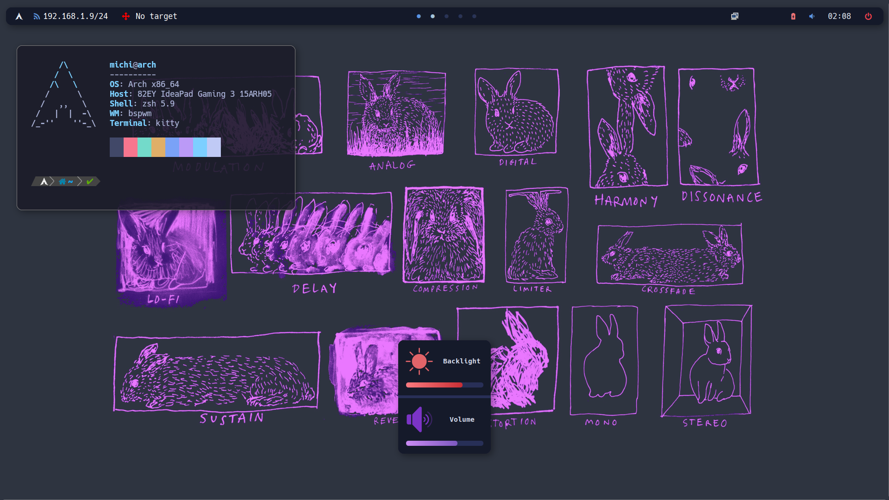

# Nombiembre/Dotfiles

## About

- Window Manager: bspwm
- Compositor: picom
- Status Bar: 
- Notifications: 
- Terminal: kitty
- Launcher: , based on [Eric Murphy configuration](https://youtu.be/TutfIwxSE_s)

  
This set of dotfiles is based on the repository [k-vernooy/dotfiles](https://github.com/k-vernooy/dotfiles), and I extend my gratitude for their work and contributions, which served as a starting point for my own personalized environment.
 
This is for my personal use to clone for easy setup on virtual machines. These dotfiles are made for my setup and might require adjustments to match your specific system and preferences. If you encounter any issues or have any questions while using these dotfiles, don't hesitate to reach out.

## Showcase

### Rofi

## To Do's
- [ ] Powermenu.
- [ ] Update polybar's private IP address module to open internet configuration on click.
- [ ] Music player module.
- [ ] Themes selector.
- [ ] Enhance the date module in polybar to display a calendar on click.
