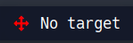
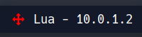

# Nombiembre/Dotfiles


## About
- Distro: Arch
- Window Manager: bspwm
- Compositor: picom
- Status Bar: polybar
- Notifications: 
- Terminal: kitty
- Launcher: Rofi, based on [Eric Murphy configuration](https://youtu.be/TutfIwxSE_s)

  
This set of dotfiles is based on the repository , and I extend my gratitude for their work and contributions, which served as a starting point for my own personalized environment.
 
This is for my personal use to clone for easy setup on virtual machines. These dotfiles are made for my setup and might require adjustments to match your specific system and preferences. If you encounter any issues or have any questions while using these dotfiles, don't hesitate to reach out.

## Showcase

### Rofi


### Set Target
<br><br>
The module operates with a terminal command format: settarget "parameter1 parameter2". To use this command in the terminal, you need to add the following function to your .bashrc, .zshrc, or the respective shell configuration file:

```sh
function settarget(){
    ip_address=$1
    machine_name=$2
    echo "$ip_address $machine_name" > /home/yourUsername/.config/bin/target.txt
}
```

When executed, the function stores the given parameters parameter1 and parameter2 in a file called target.txt, located in the directory ~/.config/bin.

In addition to the function, there is a script called set_target.sh, residing in the directory ~/.config/bin. This script reads the contents of the target.txt file and echoes the stored parameters from the settarget command to the polybar module.

Credits:

The settarget command and the set_target.sh script were created by the original author, . The implementation details and tutorial can be found in this .


## To Do's
- [ ] Powermenu.
- [ ] Update polybar's private IP address module to open internet configuration on click.
- [ ] Music player module.
- [ ] Themes selector.
- [ ] Enhance the date module in polybar to display a calendar on click.
